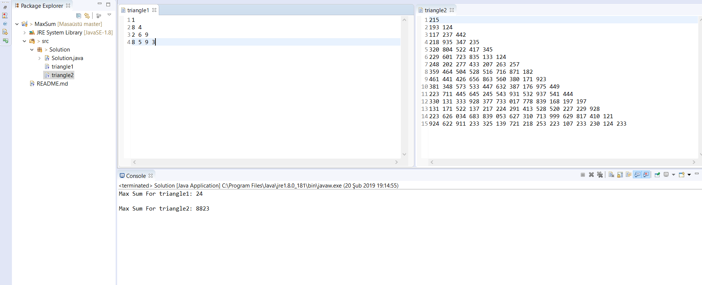

### For Running The Project
1.Install zip of this project and extract it. 
2.Install Eclipse IDE. 
3.In Eclipse IDE, import installed project by choosing "File>Import>General>Projects from Folder or Archive" and select the project folder. 
4.Run the project. 

## Screenshot

